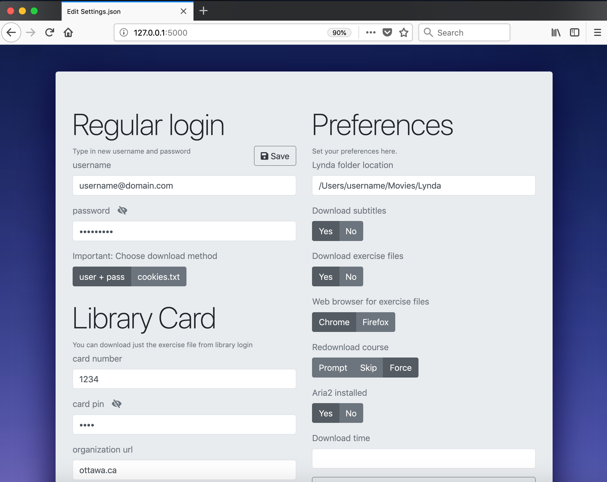

# Lyndor

[](https://travis-ci.org/ankitsejwal/Lyndor)

* Download [**Lynda.com**](https://www.lynda.com) course for personal offline use.
* You will need a Lynda.com Basic, Premium or Organisation account inorder to download a course.

```
  Features:

- Organizational login (cookies.txt)    - Regular login (Username + Password combination)
- Cross platform support                - Runs on both Python2 and Python3
- Exercise file download                - Subtitles download
- Lib. card + pin support for ex-file   - Schedule download (Download later)
- Creates Course & Chapter folders      - Generate Info files
- Videos and subtitles renaming         - Move videos/subtitles to correct Chapters
- Adjust preferences (settings.json)    - aria2 external downloader (for faster downloads)
- Bulk downloads                        
```


* On providing course url, the program will download - Course Folder, Chapters, Videos, Subtitles and Info files.
* Download multiple courses by pasting several urls in **Bulk Download.txt**
* info.txt and CONTENT.md file is created, containing additional info about the course.
* **NOTE:** The Basic and Premium account costs about $20 and $30 respectively once the 30 day free trial ends, which is not much considering you are investing in your career or following your passion, thus you may get exponential returns.

```python
#supports multiple platforms :)
def Operating_Systems():
    Windows = True
    MacOS   = True
    Linux   = True

    if Windows or MacOs or Linux:
        print('Have fun!!!')
```

## Requirements

* **Python 2 or Python 3**
* Python is free and comes pre-installed in MacOS and most Linux distributions, Windows users can install python from official [**python**](https://www.python.org/download/releases/2.7/) website
* **NOTE:** Windows users must add python.exe to path


## Install Lyndor

```bash
    # Download Lyndor
    # Open terminal or commandline
    $ python path/to/Lyndor/install.py

    # Apart from many other processes, install.py creates a Lynda folder inside your
    # Videos or Movies folder, all the courses will be downloaded to Lynda folder
    # to change path later, paste your desired path into settings.json
```

Note: **Windows** users can simply double click **install.bat** file to run install.py file alternatively.

## Lynda Folder Structure

```
- Lynda Folder          (Here goes all your downloaded courses)
---- Course1
---- Course2
---- Course3
---- Course4
-- Bulk Download.txt    (Paste multiple urls for bulk download)
-- Run-Lyndor.bat       (For windows user only, double click to launch program)
```

## Course Folder Structure

```
- Course1 Folder
---- CONTENT.md
---- info.txt
---- 00 - Chapter A     // chapter folder
---- 01 - Chapter B     // ...
---- 02 - Chapter C
-- 1 - Video A          // video file
-- 2 - Video B          // video file
-- 3 - Video C          // ...
-- 1 - Video A.srt      // subtitle file
-- 2 - Video B.srt      // subtitle file
-- 3 - Video C.srt      // ...
```

## Lyndor Folder Structure

```
- Lyndor Folder
---- LICENSE
-- run.py                   (main file - execute the file, to run the program)
-- save.py
-- download.py
-- ...
-- ...
-- ...
-- install.py
--- webdriver               (directory)
  - chromedriver.zip
  - firefoxdriver.zip
--- aria2c                  (visible to Windows users only)
  - aria2c.zip
--- settings                (directory)
  -- static                 (directory)
  --- css                   (sub-directory)
  --- js                    (sub-directory)
    ---- settings.json      (settings goes here)
    ---- settings.js
  -- templates              (directory)
  -  settings.py        --> Flask webserver (python settings.py) 
```

## Usage

* In order to begin download you have to edit settings.json file first. Have a look in settings folder you will find settings.py
```
--- settings            (directory)
  -- static             (sub-directory)
  -- templates          (sub-directory)
  -  settings.py        --> Flask webserver (python settings.py) 
```
 
```bash
#  open terminal/cmd navigate to this folder and run
$  python settings.py 

#  This will run a local Flask web server (terminal output below):
#  * Running on http://127.0.0.1:5000/ (Press CTRL+C to quit)
#  * Restarting with stat
#  * Debugger is active!
#  * Debugger PIN: 188-604-022

```

* Now just visit http://127.0.0.1:5000/ in any web-browser (Chrome/Firefox/Safari)



Just edit your preferences and add your credentials here then simply hit Save button, settings.json file will be updated.
(settings.json file can be edited directly via text editor as well but editing json file for beginner maybe a bit challenging.)

* Lynda course can be downloaded in two ways, either with username + password combination or with cookies.txt file
* Add your username and password to settings.json easily through a web page
* For organization login - use cookie method (learn more below)

```javascript
// settings.json - File

{
    "credentials": {
        "regular_login": {
            "username": "",                         // not required if downloading via cookies
            "password": ""
        },
        "library_login": {
            "card_number": "",                      // Library card number
            "card_pin": "",                         // Library card pin
            "organization_url": ""                  // org. url like: ottawa.ca
        },
        "exfile_download_pref": "regular-login",
        "course_download_pref": "regular-login",
    },
    "preferences": {
        "location": "/path/to/folder/Lynda",
        "download_subtitles": true,                 // set false otherwise
        "download_exercise_file": true,             // set false otherwise
        "web_browser_for_exfile": "chrome",         // prefered web browser "chrome" or "firefox"
        "ext-downloader-aria2-installed": false,    // set true after installing aria2
        "download_time": "",                        // time schedule download (ex: "01:00" for 1am)
        "redownload_course": "prompt"               // choose between prompt, skip or force
    }
}

```

## Run Lyndor


```bash
# open terminal or commandline
$ python path/to/Lyndor/run.py
```

* **Windows** users can simply double click **Run-Lyndor.bat** to run the program. Run-Lyndor.bat file should be located in (Lynda) folder where all courses are meant to be downloaded.

```bash
# Linux and MacOS users can add Lynda keyword as alias to launch the program by just typing Lynda in terminal.
$ alias lyndor='python /path-to/Lyndor/run.py'
```

* [**How to create alias?**](https://www.moncefbelyamani.com/create-aliases-in-bash-profile-to-assign-shortcuts-for-common-terminal-commands/)

* The program will ask now for URL, just paste a Course URL in the Terminal/Command-prompt -> press enter.

### If you wish to download via cookies (Recommended for Organizational login)
-------------------------

* Extract cookies from browser after login to Lynda.com by addon [cookies.txt](https://chrome.google.com/webstore/detail/cookiestxt/njabckikapfpffapmjgojcnbfjonfjfg) extension
* Your cookies.txt file must be downloaded in either Downloads or Desktop folder.

### Exercise files download
---------------------------

* Note: This feature isn't available for organizational login, also follow the steps below after Lyndor installation.

* During installation two webdriver files will be downloaded inside the webdriver folder

```bash
-- ...
-- ...
-- ...
-- install.py
--- webdriver           (directory)
  - chromedriver.zip
  - firefoxdriver.zip
```

* unzip both the ***driver.zip files to reveal the actual files inside it, then copy the webdriver folder path to add to your PATH variable.

```bash
# for Mac or Linux -> add the new webdriver directory path to ~/.bash_profile or ~/.bash_rc
export PATH="/path/to/Lyndor/webdriver:$PATH"
```

* Windows users can save the path as usual, here's an example [**saving PATH in windows**](https://www.youtube.com/watch?v=Y2q_b4ugPWk), note in the video some different directory is used as a demonstration, you just have to paste in 'webdriver' directory's path instead.

```javascript
// settings.json - File
...
...
        "download_exercise_file": false,         // set true to download exercise files
        "web_browser_for_exfile": "chrome",
        "download_time": ""
    }
}
```

## aria2 downloader for faster downloads


```javascript
// settings.json - File
...
...
        "ext-downloader-aria2-installed": false, // set true after installing aria2
        "location": "/path/to/folder/Lynda",
        "download_exercise_file": false,
...
...        
     }
}
```

* You have an option related to external downloader in settings.json which you can set true for faster downloads, but you need to install the aria2 installer first.

* For Mac and Linux users it is very easy to install aria2c from command line.

```bash
# for example you can download aria2 on MacOs using homebrew
$ brew install aria2
```

* Windows users need .exe file to install it, which this program downloads for windows users, you can find a folder inside Lyndor, called 'aria2', it will contains aria2.zip file, just extract the zip file and set the path of the directory to windows PATH variable here's an example [**saving PATH in windows**](https://www.youtube.com/watch?v=Y2q_b4ugPWk), watch the video to get a general idea.

## Reporting Issues

* Each release of the program is well tested on MacOS, feedback and bug reporting for Windows and Linux operating system is needed and will be greatly appreciated.

## Requesting Features

* New features are being requested constantly, you are encouraged to ask for a new feature by creating a new issue. 

## Acknowledgement

* Thanks to [**youtube-dl**](https://github.com/rg3/youtube-dl), selenium, beautifulsoup, requests, colorama for providing their open source code to enable this project.
